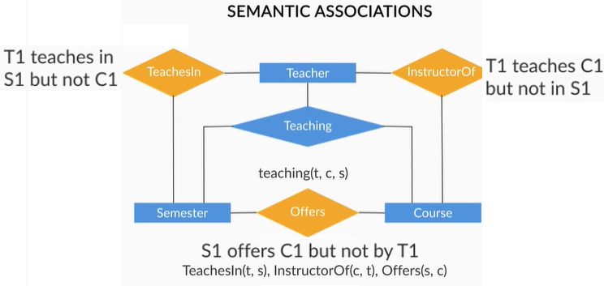
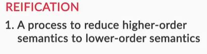
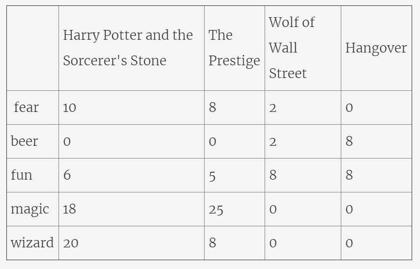
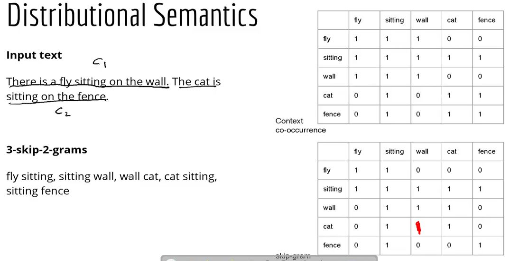
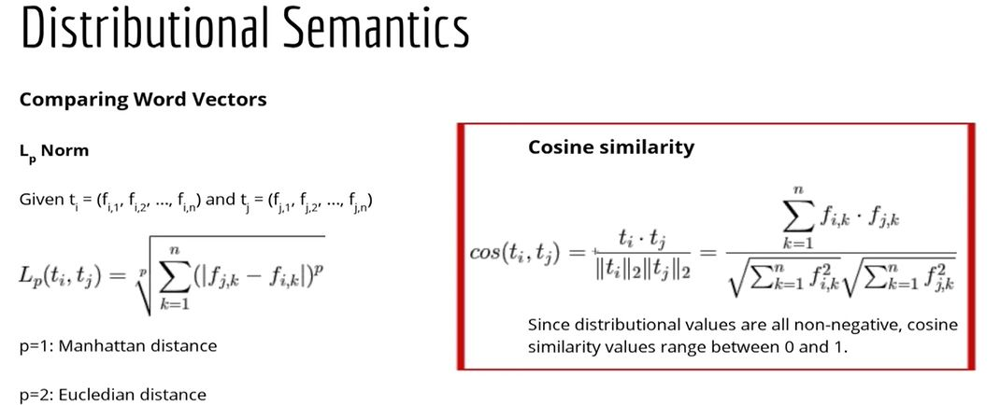
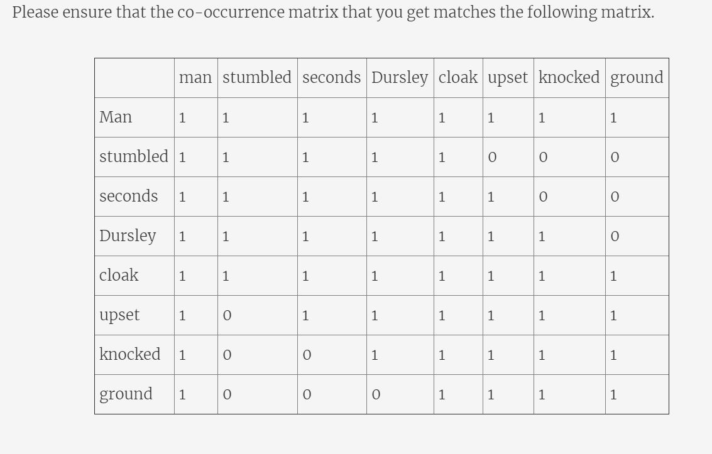
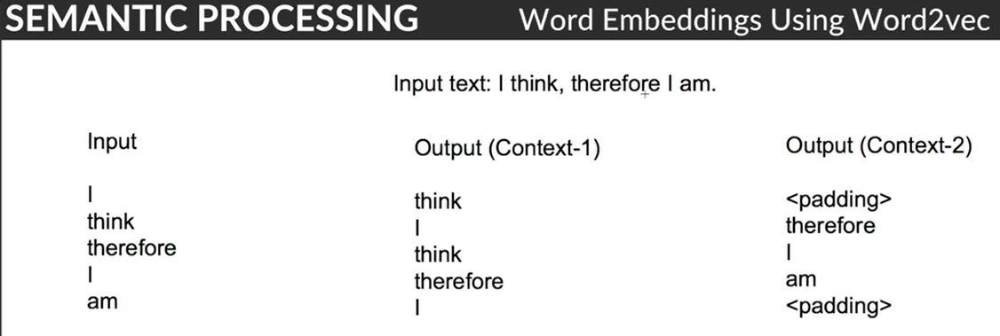

# Introduction to Semantic Processing

## Concepts and Terms
Semantic processing is about understanding the meaning of a given piece of text. But what do we mean by 'understanding the meaning' of text? Let's see how the human brain processes meaning.

When you hear the sentence:

"Croatia fought hard before succumbing to France's deadly attack; lost the finals 2 goals to 4",

you understand that this text is about football and the FIFA world cup final, even though the words 'football' and 'FIFA' are not mentioned in the sentence. Also, you understand that the words 'succumb' and 'goal' are used differently than in the sentences *'He succumbed to head injuries and died on the spot'* and *'My life goals'*.

Your brain can process sentences meaningfully because it can relate the text to other words and concepts it already knows, such as football, FIFA etc. It can process meaning in the **context of the text** and can **disambiguate between multiple possible senses** of words such as 'goal' and 'succumb'. Also, your brain has an understanding of **topics being talked about** in a text, such as 'football' and 'FIFA World Cup', even though these exact words are not present in the text.

Semantic text processing focusses on teaching machines to process text in similar ways.

Specifically, some areas of semantics we will study in this course are **word sense disambiguation** (identifying the intended meaning of an ambiguous word), representing **words as vectors** semantically similar to other words,  **topic modelling** (identifying topics being talked about in documents) etc.

But before all that, we need to build a basic understanding of the question - "what is meaning?". In the first few segments, we'll discuss this question from multiple angles.

To study semantics, we first need to establish a representation of ‘meaning’. Though we often use the term ‘meaning’ quite casually, it is quite non-trivial to answer the question “What is the meaning of meaning, and how do you represent the meaning of a statement?” (take a shot - try writing an answer to this question in 100 words).  

Clearly, you cannot build 'parse trees for meaning' or assign 'meaning tags' to each word. Thus, the first step in semantic processing is to create a model to interpret the 'meaning' of text.

To get a sense of why this task is non-trivial, consider a conversation between you and an alien who landed on Earth just a few weeks ago:

There are objects which exist but you cannot touch, see or hear them, such as independence, freedom, algebra and so on. But they still do exist and occur in natural language. We refer to these objects as 'concepts'.

The idea of 'concepts' forms an important component in the representation of meaning. Let’s now understand how **concepts** and **terms** are used to define meaning.

To summarise, terms act as handles to concepts and the notion of ‘concepts’ gives us a way to represent the ‘meaning’ of a given text.

But how do terms acquire certain concepts? It turns out that the context in which terms are frequently used make the term acquire a certain meaning. For e.g. the word ‘bank’ has different meanings in the phrases ‘bank of a river’ and ‘a commercial bank’ because the word happens to be used differently in these contexts.

Next, you will study two important concepts which will help you understand the anatomy of ‘meaning’ better:
1. Terms which appear in similar contexts are similar to each other
2. Terms acquire meaning through use in certain contexts, and the meaning of terms may change depending on the context in which they appear

### Entity and Entity Types
We have seen that **concepts** and **terms** are closely related to each other - terms acting as handles for concepts. Let's now look at two other concepts which will help us refine our representation of meaning further - **entities** and **entity types**.

To summarise, you learnt that **entities** are instances of **entity types**. Also, you saw that multiple entity types can be grouped under a **concept**.

You will see that we can use this hierarchical model of concepts, entities and entity types to answer some real-world questions and process the 'meaning' of sentences. 

### Associations Between Entity Types
Say you ask Alexa, 'Alexa, what is a Labrador?', it answers 'It is a breed of dogs '. Say you ask 'Who is the coach of the Indian cricket team?', it reveals the name of the coach.

To answer such questions, a system needs some kind of **mapping between entities and entity types**, i.e. it needs to understand that a Labrador is a dog, a mammal is an animal, a coach is a specific person etc.

This brings us to the concept of **associations** between entities and entity types. These associations are represented using the notion of **predicates**. Let’s understand the idea of predicates.

To summarise, you saw that the notion of a **predicate** gives us a simple model to process the meaning of complex statements. For example, say you ask an artificial NLP  system - "Did France win the football world cup final in 2018?". The statement can be broken down into a set of predicates, each returning True or False, such as win(France, final) = True, final(FIFA, 2018) = True. 

A predicate is a function which takes in some parameters and returns True or False depending on the relationship between the parameters. For example, a predicate teacher_teaches_course(P = professor Srinath, C = text analytics) returns True.

You also saw that processing meaning involves understanding the **associations between entities**.  For e.g. "A football team is comprised of 11 players" is an example of relation type =2 (since there are two entity types -  team &  players), though the relationship instance is 11 (since there are 11 instances of the entity). 

### Arity and Reification
Consider that these three statements are true:
* Shyam supplies cotton to Vivek
* Vivek manufactures t-shirts
* Shyam supplies cotton which is used to manufacture t-shirts
 
Can you conclude that the following statement is also true - "Shyam supplies cotton to Vivek which he uses to manufacture t-shirts"?

We saw that predicates are assertions that take in some parameters, such as supplier_manufacturer(Shyam, Vivek), and return True or False. But most real-world phenomena are much more complex to be represented by simple **binary predicates**, and so we need to use **higher-order** predicates (such as the ternary predicate supplier_manufacturer_product(Shyam, Vivek, t-shirts)).

Further, if a binary predicate is true, it is not necessary that a higher order predicate will also be true. This is captured by the notion of **arity of a predicate**. 

You saw that higher order predicates (i.e. having a large number of entity types as parameters) are complex to deal with. 

Even if all the binary relationships of a ternary relationship are true, it still does not imply that the ternary relationship will also be true. This implies that, in general, we cannot simply break down complex sentences (i.e. higher order predicates) into multiple lower-order predicates and verify their truth by verifying the lower-order predicates individually. 

To solve this problem, we use a concept called **reification**. 

To summarise, reification refers to combining multiple entity types to convert them into lower order predicates. 

In the next segment, you will study an example of a huge knowledge graph called **schema.org** which uses the concepts you have learnt so far to create a schema for a wide variety of entities (and reified entities) in one structured schema.

**Additional Resources:**
1. To understand RDFs in detail, please refer to the following links:
    * [RDF-concepts](https://www.w3.org/TR/rdf-concepts/)
    * [RDF-syntax](https://www.w3.org/TR/PR-rdf-syntax/)

### Schema
In the previous few segments, we saw that we need a structure using which we can represent the meaning of sentences. One such schematic structure (used widely by search engines to index web pages) is [schema.org](https://schema.org/docs/faq.html).

Schema.org is a joint effort by Google, Yahoo, Bing and Yandex (Russian search engine) to create a large schema relating the most commonly occurring entities on web pages. The main purpose of the schema is to ease search engine querying and improve search performance.

For example, say a web page of a hotel (e.g. Hotel Ginger) contains the words 'Ginger' and 'four stars'. How would a search engine indexing this page know whether the word 'Ginger' refers to the plant ginger or Hotel Ginger? Similarly, how would it know whether the phrase 'four stars' refers to the rating of a hotel or to astronomical stars?

To solve this problem, schema.org provides a way to explicitly specify the types of entities on web pages. For example, one can explicitly mention that 'Ginger' is the name of the hotel and specify various entities such as its rating, price etc. (example HTML shown below).

Even if you are not familiar with HTML, just notice the attributes itemtype='Hotel' and itemprop='name', 'rating' and 'price'. These attributes explicitly mention that the text on the web page (in the section inside the 
) is about a hotel, that the hotel's name is Ginger, its rating is four stars and the price is INR 3500. 

Let's learn about schema.org in more detail.

Huge schemas or 'knowledge graphs' of the world, such as schema.org, are quite important while building semantic processing engines (such as web search engines). Although you will not be working on such schemas/web-based search in this course, it is an important resource to know about.

You can read more about schema.org here:
* An example showing [how a web page can use schema.org](https://schema.org/docs/gs.html) to specify entity types 
* How [banks and financial institutions can use schemas](https://schema.org/docs/financial.html) for marking up banks and their products 
* Schema.org [FAQs](https://schema.org/docs/faq.html): The basics of schema.org (who, what, why etc.) answered concisely

### Semantic Associations
We have studied that entities have associations such as "a hotel <ins>has a</ins> price", "a hotel <ins>has a</ins> rating", "ginger <ins>is a</ins> plant" etc. Let's study some common types of associations.

### Aboutness
When machines are analysing text, we not only want to know the type of semantic associations ‘is-a’ and ‘is-in’ but also want to know what is the word or sentence about. Take, for example, the example that we took at the start of the session:

*‘Croatia fought hard before succumbing to France's deadly attack; lost the finals 2 goals to 4.’*

In the above text, if we want the machine to detect the game of football (it could be about other sports such as hockey as well, but let’s keep things simple and assume it’s about football), then we need to formally define the notion of **aboutness**.

We can, for example, detect that the game is football by defining semantic associations such as “Croatia” is-a “country”, “France” is-a “country”, “finals” is-a “tournament stage”, “goals” is-a “scoring parameter” and so on. By defining such relationships, we can probably infer that the text is talking about football by going through the enormous schema. But you can imagine the kind of search this simple sentence would require. Even if we search through the schema, it doesn’t mean we’ll be able to decide that the game is football.

This leads us to define another semantic association - **‘aboutness’**. Let’s understand about ‘aboutness’ in the following segment.

Thus, to understand the 'aboutness' of a text basically means to identify the ‘topics' being talked about in the text. What makes this problem hard is that the same word (e.g. China) can be used in multiple topics such as politics, the Olympic games, trading etc.

We will study the idea of ‘aboutness’ and topics in detail in the third session on topic modelling. For now, let's study some nomenclatures used to classify types of associations between terms and concepts.

The five kinds of relationship between different words can be grouped as follows:

1. **Hypernyms and hyponyms**: This shows the relationship between a generic term (hypernym) and a specific instance of it (hyponym). For example, the term ‘Punjab National Bank’ is a hyponym of the generic term ‘bank’
2. **Antonyms**: Words that are opposite in meanings are said to be antonyms of each other. Example hot and cold, black and white etc.
3. **Meronyms** and **Holonyms**: A term ‘A’ is said to be a holonym of term ‘B’ if ‘B is part of ‘A’ (while the term ‘B’ is said to be a meronym of the term ‘A’). For example, an operating system is part of a computer. Here, ‘computer’ is the holonym of ‘operating system’ whereas ‘operating system’ is the meronym of ‘computer.
4. **Synonyms**: Terms that have a similar meaning are synonyms to each other. For example, ‘glad’ and ‘happy’.
5. **Homonymy** and **polysemy**: Words having different meanings but the same spelling and pronunciations are called homonyms. For example, the word ‘bark’ in ‘dog’s bark’ is a homonym to the word ‘bark’ in ‘bark of a tree’. Polysemy is when a word has multiple (entirely different) meanings. For example, consider the word 'pupil'. It can either refer to students or eye pupil, depending upon the context in which it is used.

Even after defining such a wide range of association types, one cannot cover the wide range of complexities of natural languages. 

For example, consider how two words are often put together to form a phrase. The semantics of the combination of these words could be very different than the individual words. For example, consider the phrase - ‘cake walk’. The meanings of the terms 'cake' and 'walk' are very different from the meaning of their combination.

Such cases are said to violate the **principle of compositionality**.

You saw that the principle of compositionality, although valid in most cases, is often violated as well. This is an important insight to understand the nature of semantics and will be useful in developing techniques and algorithms for semantic processing.

### Databases - WordNet and ConceptNet
WordNet is a semantically oriented dictionary of English, similar to a traditional thesaurus but with a richer structure.

WordNet is a part of NLTK and you will use WordNet later in this module to identify the 'correct' sense of a word (i.e for word sense disambiguation).

Another important resource for semantic processing is **ConceptNet** which deals specifically with assertions between concepts. For example, there is the concept of a “dog”, and the concept of a “kennel”. As a human, we know that a dog lives inside a kennel. ConceptNet records that assertion with /c/en/**dog**  /r/**AtLocation** /c/en/**kennel**.

ConceptNet is a representation that provides commonsense linkages between words. For example, it states that bread is commonly found near toasters. These everyday facts could be useful if, for e.g., you wanted to make a smart chatbot which says - “Since you like toasters, do also like bread? I can order some for you.”

But, unfortunately, ConceptNet isn’t organized as well as one would want. For instance, it explicitly states that a toaster is related to an automobile. This is true since they are both mechanical machines, but you wouldn't want for e.g. a chatbot to learn that relationship in most contexts.

**Additional Readings:**
* [Wordnet](https://wordnet.princeton.edu/)
* [Tutorial on Wordnet - Python](https://stevenloria.com/wordnet-tutorial/)
* [Conceptnet](http://conceptnet.io/)

### Word Sense Disambiguation - Naive Bayes
Now that you have learnt the building block of semantic processing, let's learn to solve a common problem in semantic analysis - **word sense disambiguation**. 

Word sense disambiguation (WSD) is the task of identifying the correct sense of an ambiguous word such as 'bank', 'bark', 'pitch' etc.

Let's understand the various techniques used for word sense disambiguation.

Supervised techniques for word sense disambiguation require the input words to be tagged with their senses. The sense is the label assigned to the word.  In unsupervised techniques, words are not tagged with their senses, which are to be inferred using other techniques.

Let’s talk about supervised techniques first. One of the simplest text classification algorithms is the **Naive Bayes Classifier**.

### Word Sense Disambiguation - Lesk Algorithm
As with most machine learning problems, lack of labelled data is a common problem in building disambiguation models. Thus, we need unsupervised techniques to solve the same problem.  

A popular unsupervised algorithm used for word sense disambiguation is the Lesk algorithm.

There are various ways in which you can use the lesk algorithm. Apart from what has been discussed, you can just take the definitions corresponding to the different senses of the ambiguous word and see which definition overlaps maximum with the neighbouring words of the ambiguous word. The sense which has the maximum overlap with the surrounding words is then chosen as the ‘correct sense’.

Let's now use lesk algorithm to disambiguate the word 'bank' in a text.

[Lesk Algorithm in NLTK](dataset/Lesk+Algorithm+in+NLTK.ipynb)

Recall that WordNet has a network of synonyms called synset for individual words.

### Lesk Algorithm Implementation
Let’s implement the lesk algorithm in python from scratch in this segment, unlike the previous section where you used NLTK’s implementation of lesk algorithm.

Please refer to the following notebook:

[Lesk Algorithm](dataset/Lesk_Algorithm.ipynb)

You saw how the Lesk algorithm helps in word sense disambiguation. The word **'bank'** can have multiple meanings depending on the surrounding (or the context) words. The lesk algorithm helps in finding the 'correct' meaning.

## Distributional Semantics

### Introduction
In the previous session, we had studied the idea of distributional semantics briefly - words that occur in similar contexts have similar meanings. In this session, we will study **distributional semantics** in detail (also sometimes called vector semantics).

The idea of distributional semantics (implemented through 'word vectors') has been used heavily in semantic processing for a wide variety of applications. In this session, you will learn about word vectors, word embeddings and the use of word vectors for practical NLP applications.

This session will introduce you to the following topics:
* Word vectors (occurrence context and co-occurrence matrices)
* Word embeddings (frequency and prediction-based embeddings)
* Frequency-based embeddings: Latent Semantic Analysis (LSA)
* Prediction-based embeddings: Word2Vec
* Using word embeddings in Python for practical applications

### Introduction to Distributional Semantics
The English linguist John Firth had said in 1957 -
    *‘You shall know a word by the company it keeps’.*

In a previous segment, we had studied the concept of **distributional semantics** briefly- words which appear in the same contexts have similar meanings. This simple idea has probably been the most powerful and useful insight in creating semantic processing systems. You will now learn study this idea in detail and learn to use it for various semantic processing applications.

To summarise, the basic idea that we want to use to **quantify the similarity between words** is that words which occur in similar contexts are similar to each other. To do that, we need to represent words in a format which encapsulates its similarity with other words. For e.g. in such a representation of words, the terms ‘greebel’ and ‘train’ will be similar to each other.

The most commonly used representation of words is using **'word vectors'**. There are two broad techniques to represent words as vectors:

The term-document **occurrence matrix**, where each row is a term in the vocabulary and each column is a document (such as a webpage, tweet, book etc.)  

The term-term **co-occurrence matrix**, where the ith row and jth column represents the occurrence of the ith word in the context of the jth word. A co-occurrence matrix always has the equal number of rows and columns, because both row and column represent the terms in the vocabulary.

### Occurrence Matrix
In the previous segment, you learnt that there are two broad ways to represent how terms (words) occur in certain contexts - 1.) The term-occurrence context matrix (or simply the **occurrence matrix**) where each row is a term and each column represents an occurrence context (such as a tweet, a book, a document  etc.) and 2) the term-term co-occurrence matrix (or the **co-occurrence matrix**) which is a **square matrix** having terms in both rows and columns.

Let’s study the occurrence matrix first.

Also, notice that each word and a document has a corresponding vector representation now - each row is a vector representing a word, while each column is a vector representing a document (or context, such as a tweet, a book etc.). Thus, you can now perform all common vector operations on words and documents. 

**Question**
* Think about why the distributional frequency and distributional relevancy matrices might be a better representation than the vanilla incidence matrix.
* **Answer**: It will give lower weights to more frequent words; for e.g. in a word-sentence matrix, if many sentences contain the word ‘might’ (which is not a stopword btw since it is also a noun), the word ‘might’ will be assigned a lower weight, after discounting for its frequent occurrence.

Note that the **occurrence matrix** is also called a **term-document matrix** since its rows and columns represent terms and documents/occurrence contexts respectively.

#### Comprehension: The Term-Document Matrix
Consider four documents each of which is a paragraph taken from a movie. Assume that your vocabulary has only the following words: fear, beer, fun, magic, wizard.

The table below summarises the **term-document** matrix, each entry representing the frequency of a term used in a movie:

**Question1**
You know that the dot product of two vectors is large if the two vectors are ‘similar’ to each other. Based on the dot-product of vectors of each movie, which two movies are the most similar to each other?

**Question2**

Term-document matrices (or **occurrence context** matrices) are commonly used in tasks such as **information retrieval**. Two documents having similar words will have similar vectors, where the **similarity between vectors** can be computed using a standard measure such as the **dot product**. Thus, you can use such representations in tasks where, for example, you want to extract documents similar to a given document from a large corpus.

However, note that a real term-document matrix will be much **larger and sparse**, i.e. it will have as many rows as the size of the vocabulary (typically in tens of thousands) and most cells will have the value 0 (since most words do not occur in most documents).

Using the term-document matrix to compare similarities between terms and documents poses some serious shortcomings such as with **polysemic words**, i.e. words having multiple meanings. For example, the term ‘Java’ is polysemic (coffee, island and programming language), and it will occur in documents on programming, Indonesia and cuisine/beverages.

So if you imagine a high dimensional space where each document represents one dimension, the (resultant) vector of the term ‘Java’ will be a vector sum of the term’s occurrence in the dimensions corresponding to all the documents in which 'Java' occurs. Thus, the vector of ‘Java’ will represent some sort of an ‘average meaning’, rather than three distinct meanings (although if the term has a predominant sense, e.g. it occurs much frequently as a programming language than its other senses, this effect is reduced).

In the next segment, you will study an alternate way to generate a distributed representation of words - the term-term **co-occurrence** matrix, where both rows and columns represent a term (word). 

### Co-occurrence Matrix
Apart from the occurrence context matrix, the other way to create a distributed representation of words is the **term-term co-occurrence** matrix (or simply the **co-occurrence matrix**), which you’ll study next.

Unlike the occurrence-context matrix, where each column represents a context (such as a document), now the columns also represent a word. Thus, the co-occurrence matrix is also sometimes called the **term-term** matrix.

There are two ways of creating a co-occurrence matrix:
1. **Using the occurrence context (e.g. a sentence):**
    * Each sentence is represented as a context (there can be other definitions as well). If two terms occur in the same context, they are said to have occurred in the same occurrence context.
2. **Skip-grams (x-skip-n-grams):**
    * A sliding window will include the (x+n) words. This window will serve as the context now. Terms that co-occur within this context are said to have co-occurred.

### Word Vectors
In the previous section, we learnt the following two approaches to create a co-occurrence matrix:
* Occurrence context matrix
* x-skip-n-grams (more generally, skip-grams)

Note that it has been assumed that a word occurs in its own context. So, all the diagonal elements in the matrix are 1.

To summarise, there are two approaches to create the term-term co-occurrence matrix:
1. **Occurrence context:**
    * A context can be defined as, for e.g., an entire sentence. Two words are said to co-occur if they appear in the same sentence. 
2. **Skipgrams:**
    * 3-skip means that the two words that are being considered should have at max 3 words in between them, and 2-gram means that we are going to select two words from the window.
 
In a previous question on term-document matrices, you had used the dot product of two vectors to compare the similarities between vectors. Let’s now look at some other similarity metrics we can use.

### Word Embeddings
In the previous segment, you saw how to create different kinds of word vectors. You may have noticed is that the occurrence and co-occurrence matrices have really large dimensions (equal to the size of the vocabulary V). This is a problem because working with such huge matrices make them almost impractical to use. You will see how to tackle this problem now.

Let’s first summarise all that you have learnt about word vectors till now.

You already know that the occurrence and co-occurrence matrices are **sparse** (really sparse!) and **high-dimensional**. Talking about high dimensionality - why not reduce the dimensionality using matrix factorization techniques such as SVD etc.?

This is exactly what **word embeddings** aim to do. Word embeddings are a compressed, **low dimensional** version of the mammoth-sized occurrence and co-occurrence matrices.

Each row (i.e word) has a much **shorter vector** (of size say 100, rather than tens of thousands) and is **dense**, i.e. most entries are non-zero (and you still get to retain most of the information that a full-size sparse matrix would hold).

Let's see how you can create such dense word vectors.

What are the different ways in which you can generate word embeddings? Let's see in the following segment.

Word embeddings can be generated using the following two broad approaches:
1. **Frequency-based approach:** Reducing the term-document matrix (which can as well be a tf-idf, incidence matrix etc.) using a dimensionality reduction technique such as SVD (Singular Value Decomposition).
2. **Prediction based approach:** In this approach, the input is a single word (or a combination of words) and output is a combination of context words (or a single word). A shallow neural network learns the embeddings such that the output words can be predicted using the input words.

We will learn prediction based approaches in more detail shortly.

### Latent Semantic Analysis (LSA)
Let's now discuss a **frequency-based approach** to generate word embeddings - **Latent Semantic Analysis.**

Latent Semantic Analysis (LSA) uses **Singular Value Decomposition (SVD)** to reduce the dimensionality of the matrix. Let's now visualize the process of latent semantic analysis.

In LSA, you take a noisy higher dimensional vector of a word and project it onto a lower dimensional space. The lower dimensional space is a much richer representation of the semantics of the word.

LSA is widely used in processing large sets of documents for various purposes such as **document clustering** and **classification** (in the lower dimensional space), comparing the similarity between documents (e.g. recommending similar books to what a user has liked), finding relations between terms (such as synonymy and polysemy) etc.

Apart from its many advantages, LSA has some **drawbacks** as well. One is that the resulting dimensions are not interpretable (the typical disadvantage of any matrix factorisation based technique such as PCA). Also, LSA cannot deal with issues such as polysemy. For e.g. we had mentioned earlier that the term ‘Java’ has three senses, and the representation of the term in the lower dimensional space will represent some sort of an ‘average meaning’ of the term rather than three different meanings.

However, the convenience offered by LSA probably outweighs its disadvantages, and thus, it is a commonly used technique in semantic processing (you'll study one use on the next page).

Let's now learn to implement LSA in Python. 

The task here is to decrease the number of dimensions of the document-term matrix, i.e. reduce the #documents x #terms matrix to #documents x #LSA_dimensions. So, each document vector will now be represented by a lower number of dimensions.

Please refer the following notebook :

[LSA in Python](dataset/LSA_in_python.ipynb)

### Comprehension - Latent Semantic Analysis
Say you work at a media company (e.g. the Times group, Free Press, The Hindu etc.) and have a set of **100,000 news articles** (documents) printed over the past few months. You want to conduct various types of analyses on news articles, such as recommending relevant articles to a given user, comparing the similarity between articles etc. The size of the **vocabulary** is **20,000 words.**

You create two matrices to capture the data - a vanilla **term-document matrix A** where each row represents a document d and each column represents a term w, and another matrix B which is created by performing LSA with **k=300** dimensions on the matrix A.

Assume that the matrix A is constructed using tf-idf frequencies. Also, assume that each document has a label representing its news category (sports, stock market, politics, startups etc.).

### Skipgram Model
Let's now study **prediction-based approaches** for creating word embeddings.

Please note that you will study neural networks in detail later, for now, you only need to understand the input and the output fed to the network; you can ignore how the network is trained, the exact architecture etc.

Please note that, while considering the training data for the skipgram model, we should also consider ([be,be],will).

Let's understand the implementation of the skip-gram model through an example.

In the skip-gram approach to generating word vectors, the input is your target word and the task of the neural network is to predict the context words (the output) for that target word. The input word is represented in the form of a 1-hot-encoded vector. Once trained, the weight matrix between the input layer and the hidden layer gives the word embeddings for any target word (in the vocabulary).

**Fun exercise!**

Check out this fun app - [Print words that are highly correlated to the input word.](https://embeddings.macheads101.com/word?word=football) Try entering any random word, it will output all the words that are most related to that word, along with the similarity score!

#### Comprehension - Word2Vec
Word2vec is a technique used to compute word-embeddings (or word vectors) using some large corpora as the training data.

Say you have a large corpus of vocabulary |V| = 10,000 words. The task is to create a word embedding of say 300 dimensions for each word (i.e. each word should be a vector of size 300 in this 300-dimensional space).

The first step is to create a distributed representation of the corpus using a technique such as skip-gram where each word is used to predict the neighbouring ‘context words’. Let's assume that you have used some k-skip-n-grams.

The model’s (a neural network, shown below) task is to learn to predict the context words correctly for each input word. The input to the network is a one-hot encoded vector representing one term. For e.g. the figure below shows an input vector for the word ‘ants’.

The hidden layer is a layer of neurons - in this case, 300 neurons. Each of the 10,000 elements in the input vector is connected to each of the 300 neurons (though only three connections are shown above). Each of these **10,000 x 300 connections** has a **weight** associated to it. This matrix of weights is of size 10,000 x 300, where each row represents a word vector of size 300.

The output of the network is a vector of size 10,000. Each element of this 10,000-vector represents the probability of an output context word for the given (one-hot) input word.

For e.g., if the context words for the word ‘ants’ are ‘bite’ and ‘walk’, the elements corresponding to these two words should have much higher probabilities (close to 1) than the other words. This layer is called the **softmax layer** since it uses the 'softmax function' to convert discrete classes (words) to probabilities of classes.

The **cost function** of the network is thus the difference between the ideal output (probabilities of ‘bite’ and ‘walk’) and the actual output (whatever the output is with the current set of weights).

The **training task** is to **learn the weights** such that the output of the network is as close to the expected output. Once trained (using some optimisation routine such as gradient descent), the **10,000 x 300 weights** of the network represent the **word embeddings** - each of the 10,000 words having an embedding/vector of size 300. 

The neural network mentioned above is informally called 'shallow' because it has only one hidden layer, though one can increase the number of such layers. Such a shallow network architecture was used by Mikolov et al. to train word embeddings for about 1.6 billion words, which become popularly known as [Word2Vec](https://arxiv.org/abs/1301.3781).

#### Other Word Embeddings
After the widespread success of **Word2Vec**, several other (and perhaps more effective) word embedding techniques have been developed by various teams. One of the most popular is [GloVe (Global Vectors for Words)](https://nlp.stanford.edu/projects/glove/) developed by a Stanford research group.

Another recently developed and fast-growing word embedding library is [fastText](https://fasttext.cc/) developed by Facebook AI Research (FAIR). Apart from word embeddings of English, it contains pre-trained embeddings for about **157 languages** (including Hindi, Marathi, Goan, Malayalam, Tamil).

These embeddings are trained on billions of words (i.e. unique tokens), and thankfully, are available as pre-trained word vectors ready to use for text applications (for free!). You will learn to use pre-trained word vectors for text processing tasks such as classification and clustering in the upcoming sessions.

You can read more about Word2Vec, GloVe and fastText in the additional readings provided below.

**Additional Readings**
1. [Word2Vec](https://arxiv.org/abs/1301.3781): Original paper of word2vec by Mikolov et al.
2. [GloVe vectors](https://nlp.stanford.edu/projects/glove/): Homepage (contains downloadable trained GloVe vectors, training methodology etc.).
3. [fastText](https://fasttext.cc/): Word embeddings developed by FAIR on multiple languages, available for download here

### Generate Vectors using LSA
Let's now see how LSA is used to generate vectors for the words in Python. 

In the previous lab, the number of documents was kept constant and the column size was reduced, where columns represented the terms.

However, in the following exercise, the number of terms is kept constant while the number of rows (i.e. documents) is reduced.

If you compare this code-lab with the one in [LSA](LSA_in_python.ipynb), you will find that most of the code is similar except how tf-idf is used. This results in generating vectors for words in this lab, and vectors for documents in the previous lab.

 Please use the following python notebook:

 [LSA word vector Python](dataset/LSA_word_vector.ipynb)

 ### Word2vec in Python - I
In the following few segments, you will learn to train word vectors using some text corpora and to use pre-trained word vectors for text processing tasks such as classification etc.

Please use the following notebook: 

[Exploring word vectors](dataset/Exploring_Word_Vectors_v1.ipynb)

Let’s train the word vectors on a larger, more realistic dataset now - the **text8 corpus**, which is a compressed version of **Wikipedia**.

Let’s now visualize the word vectors obtained earlier. Since our word vectors are 100-dimensional, we will not be able to visualise them in the 100-dimensional space. Thus, we'll reduce them to a two-dimensional space using PCA and plot them on a 2-D plane.

### Word2vec and GloVe in Python - II
In the previous segment, you learnt to train word vectors using a corpus of your choice and did some basic exploratory analysis on them.

In this segment, we will experiment with parameters of word embeddings, such as the length of word vectors, the technique used to generate co-occurrence matrices (skip-gram, continuous bag-of-words or CBOW) etc. and see how the 'quality' of word vectors is affected by them.

### Length of Word Embedding
Let's first see how the length (dimensionality) of word vectors affect the output of a word2vec model.

So, you saw that higher word length captures more subtleties. Note that in absence of quantitative metrics to measure the 'goodness' of word vectors, we are measuring 'goodness' purely qualitatively by observing a few instances. 

### Skip-gram and CBOW
Apart from the skip-gram model, there is one more model that can be used to extract word embeddings for the word. This model is called **Continuous-Bag-of-Words (CBOW) model.**

Recall that **skip-gram** takes the target/given word as the input and predicts the context words (in the window), whereas **CBOW** takes the context terms as the input and predicts the target/given term.

You saw that word embeddings trained using skip-grams are slightly 'better' than those trained using CBOW for less frequent words (such as 'meandering'). By 'better', we simply mean that words similar to 'meandering', an infrequent word,  will also be infrequent words. 

You also learnt another important (though subtle) concept - the **effect of window size** on what the embeddings learn. When you choose a **small window size** (such as 5), 'similar' words will often be **synonyms**, whereas if you choose a larger window size (such as 10), 'similar' words will be **contextually similar** words. 

### Effect of Context (Training Corpus) - Optional
The training corpus also has a significant effect on what the embeddings learn, as you would expect. For example, if you train word embeddings on a dataset related to movies and financial documents, they would learn very different terms and semantic associations.

### Glove Embeddings
We had mentioned earlier that apart from Word2Vec, several other word embeddings have been developed by various teams. One of the most popular is [GloVe (Global Vectors for Words)](https://nlp.stanford.edu/projects/glove/) developed by a Stanford research group. These embeddings are trained on about 6 billion unique tokens and are available as pre-trained word vectors ready to use for text applications.

Let's now learn to use the pre-trained **GloVe embeddings**.

### Word2vec and GloVe in Python - III
In this segment, you will learn to use word embeddings for **classification tasks**. Although while you are going through this exercise, keep in mind that you can do almost any other typical ML task using word embeddings - clustering, PCA + classification etc. that you do with normal numeric features. 

Let’s first look at how a normal bag-of-words approach performs on a text classification problem. You will later see whether word embeddings give better results.

In the following segment, you will use **Bernoulli Naive Bayes** to make the predictions on the **Reuters dataset**. This dataset contains news articles from 8 categories, and the task is to classify the category of an article. Recall that Bernoulli Naive Bayes uses the presence of a term in a document (i.e. incidence) as the feature, i.e. 1 if present, 0 if not.

Please download the following python notebook and the data files.

[Classification with word vectors](dataset/02+Classification+with+word+vectors+v1.ipynb)

[Train Data](dataset/r8-train-all-terms.txt)

[Test Data](dataset/r8-test-all-terms.txt)

You saw how Bernoulli Naive Bayes perform on the dataset. Let's now use **word embeddings** to make predictions using Naive Bayes. We will try using two options:
* Use pre-trained GloVe vectors
* Train our own vectors using the corpus

To download the pre-trained GloVe vectors, please first create an account in Kaggle and then download the following data file [GloVe vectors](https://www.kaggle.com/incorpes/glove6b200d#glove.6B.200d.txt).

Now, let's make predictions using logistic regression. Later, we will also train our own word vectors and make predictions using them.

While working with word embeddings, you have two options:
1. **Training your own word embeddings:** This is suitable when you have a sufficiently **large dataset** (a million words at least) or when the task is from a **unique domain** (e.g. healthcare). In specific domains, pre-trained word embeddings may not be useful since they might not contain embeddings for certain specific words (such as drug names). 
2. **Using pre-trained embeddings:** Generally speaking, you should always start with pre-trained embeddings. They are an important performance benchmark trained on billions of words. You can also use the pre-trained embeddings as the starting point and then use your text data to further train them. This approach is known as 'transfer learning', which you will study in the neural networks course.

Note that although we have used a classification example to demonstrate the use of word embeddings, word embeddings themselves are applicable to a wide variety of ML tasks. For example, say you want to cluster a large number of documents (**document clustering**), you can create a 'document vector' for each document and cluster them using (say) k-means clustering.

You can even use word embeddings in more sophisticated applications such as conversational systems (chatbots), fact-based question answering etc.

Word embeddings can also be used in other creative ways. In the optional session (Social Media Opinion Mining  - Semantic Processing Case Study), you will see that word vectors have been modified to contain a 'sentiment score'  (the last element of each vector represents 'document sentiment'), which are then used to model opinions in tweets.

With that, you have completed the section on distributional semantics. In the next few segments, you will learn another important area of semantic processing - **topic modelling**.

### Basics of Topic Modelling with ESA
In the previous few segments, you have learnt word embeddings and their applications. Let's now move on to another important task in semantic processing - **topic modelling.**

You had briefly studied the concept of 'aboutness' (in the semantic associations segment) in the first session. Recall that the topic modelling task is to infer the 'topics being talked about' in a given set of documents.

**Note that** in this session, you will study only the basics of topic modelling, though the topic (pun intended :)) has been covered in much more detail in the **optional session named Topic Modelling**.

Let's start with the basics of topic modelling.

How do you calculate the centroid of the document? You first calculate the word vector corresponding to each word in the document, and then compute the centroid corresponding to all the word vectors by essentially taking the average of all the word vectors.

There are various ways in which you can extract topics from text:
1. PLSA - Probabilistic Latent Semantic Analysis
2. LDA - Latent Dirichlet Allocation
3. ESA - Explicit Semantic Analysis

Let's now discuss the approach of Explicit Semantic Analysis.

In **ESA**, the ‘topics’ are represented by a ‘representative word’ which is closest to the centroid of the document. Say you have N Wikipedia articles as your documents and the total vocabulary is V. You first create a tf-idf matrix of the terms and documents so that each term has a corresponding tf-idf vector.

Now, if a document contains the words sugar, hypertension, glucose, saturated, fat, insulin etc., each of these words will have a vector (the tf-idf vector). The ‘centroid of the document’ will be computed as the centroid of all these word vectors. The centroid represents ‘the average meaning’ of the document in some sense. Now, you can compute the distance between the centroid and each word, and let’s say that you find the word vector of ‘hypertension’ is closest to the centroid. Thus, you conclude that the document is most closely about the topic ‘hypertension’.

Note that it is also possible that a word which is not present in the document is closest to its centroid. For example, say you compute the centroid of a document containing the words ‘numpy’, ‘cross-validation’, ‘preprocessing’, ‘overfitting’ and ‘variance’, it is possible that the centroid of this document is closest to the vector of the term ‘machine learning’ which may not be present in the document.

### Introduction to Probabilistic Latent Semantics Analysis (PLSA)
Let's now discuss another approach for topic modelling - **PLSA**. It is a more generalized form of LSA. Note that you can study **topic modelling** (PLSA and LDA) in the next (optional) session in detail, though the following lectures will give you a good primer of the next session.

To summarise, the basic idea of PLSA is this -  

We are given a list of documents and we want to identify the topics being talked about in each document. For e.g., if the documents are news articles, each article can be a **collection of topics** such as elections, democracy, economy etc. Similarly, technical documents such as research papers can have topics such as hypertension, diabetes, molecular biology etc.

PLSA is a **probabilistic technique** for topic modelling. First, we fix an arbitrary number of topics which is a hyperparameter (say 20 topics in all documents). The basic model we assume is this - each document is a collection of some topics and each topic is a collection of some terms.

For e.g. a topic t1 can be a collection of terms (hypertension, sugar, insulin, ...) etc. t2 can be (numpy, variance, learning, ...) etc. The topics are, of course, not given to us, we are only given the documents and the terms. 

That is, we do not know:
1. How many topics are there in each document (we only know the total number of topics across all documents).
2. What is each 'topic' c, i.e. which terms represent each topic.

The **task** of the PLSA algorithm is to figure out the set of topics c. PLSA is often represented as a graphical model with shaded nodes representing observed random variables (d, w) and unshaded ones unobserved random variables (c). The basic idea for setting up the optimisation routine is to find the set of topics c which maximises the joint probability P(d, w).

Also note that the term **‘explicit’** in ESA indicates that the topics are represented by explicit terms such as hypertension, machine learning etc, rather than ‘latent’ topics such as those used by PLSA.

You can learn PLSA (and other techniques in topic modelling) in the next session on **topic modelling**.

**Additional Resources**
* [Difference between LSA and PLSA](https://ppasupat.github.io/a9online/1140.html)

 