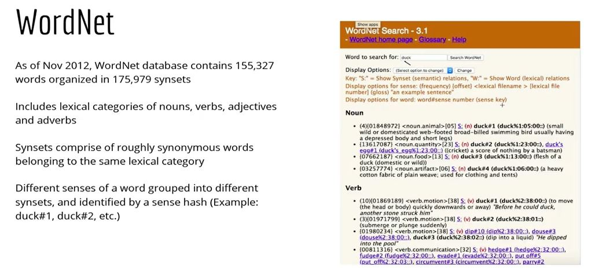

# Introduction to Semantic Processing

## Concepts and Terms
Semantic processing is about understanding the meaning of a given piece of text. But what do we mean by 'understanding the meaning' of text? Let's see how the human brain processes meaning.

When you hear the sentence:

"Croatia fought hard before succumbing to France's deadly attack; lost the finals 2 goals to 4",

you understand that this text is about football and the FIFA world cup final, even though the words 'football' and 'FIFA' are not mentioned in the sentence. Also, you understand that the words 'succumb' and 'goal' are used differently than in the sentences *'He succumbed to head injuries and died on the spot'* and *'My life goals'*.

Your brain can process sentences meaningfully because it can relate the text to other words and concepts it already knows, such as football, FIFA etc. It can process meaning in the **context of the text** and can **disambiguate between multiple possible senses** of words such as 'goal' and 'succumb'. Also, your brain has an understanding of **topics being talked about** in a text, such as 'football' and 'FIFA World Cup', even though these exact words are not present in the text.

Semantic text processing focusses on teaching machines to process text in similar ways.

Specifically, some areas of semantics we will study in this course are **word sense disambiguation** (identifying the intended meaning of an ambiguous word), representing **words as vectors** semantically similar to other words,  **topic modelling** (identifying topics being talked about in documents) etc.

But before all that, we need to build a basic understanding of the question - "what is meaning?". In the first few segments, we'll discuss this question from multiple angles.

To study semantics, we first need to establish a representation of ‘meaning’. Though we often use the term ‘meaning’ quite casually, it is quite non-trivial to answer the question “What is the meaning of meaning, and how do you represent the meaning of a statement?” (take a shot - try writing an answer to this question in 100 words).  

Clearly, you cannot build 'parse trees for meaning' or assign 'meaning tags' to each word. Thus, the first step in semantic processing is to create a model to interpret the 'meaning' of text.

To get a sense of why this task is non-trivial, consider a conversation between you and an alien who landed on Earth just a few weeks ago:

There are objects which exist but you cannot touch, see or hear them, such as independence, freedom, algebra and so on. But they still do exist and occur in natural language. We refer to these objects as 'concepts'.

The idea of 'concepts' forms an important component in the representation of meaning. Let’s now understand how **concepts** and **terms** are used to define meaning.

To summarise, terms act as handles to concepts and the notion of ‘concepts’ gives us a way to represent the ‘meaning’ of a given text.

But how do terms acquire certain concepts? It turns out that the context in which terms are frequently used make the term acquire a certain meaning. For e.g. the word ‘bank’ has different meanings in the phrases ‘bank of a river’ and ‘a commercial bank’ because the word happens to be used differently in these contexts.

Next, you will study two important concepts which will help you understand the anatomy of ‘meaning’ better:
1. Terms which appear in similar contexts are similar to each other
2. Terms acquire meaning through use in certain contexts, and the meaning of terms may change depending on the context in which they appear

### Entity and Entity Types
We have seen that **concepts** and **terms** are closely related to each other - terms acting as handles for concepts. Let's now look at two other concepts which will help us refine our representation of meaning further - **entities** and **entity types**.

To summarise, you learnt that **entities** are instances of **entity types**. Also, you saw that multiple entity types can be grouped under a **concept**.

You will see that we can use this hierarchical model of concepts, entities and entity types to answer some real-world questions and process the 'meaning' of sentences. 

### Associations Between Entity Types
Say you ask Alexa, 'Alexa, what is a Labrador?', it answers 'It is a breed of dogs '. Say you ask 'Who is the coach of the Indian cricket team?', it reveals the name of the coach.

To answer such questions, a system needs some kind of **mapping between entities and entity types**, i.e. it needs to understand that a Labrador is a dog, a mammal is an animal, a coach is a specific person etc.

This brings us to the concept of **associations** between entities and entity types. These associations are represented using the notion of **predicates**. Let’s understand the idea of predicates.

To summarise, you saw that the notion of a **predicate** gives us a simple model to process the meaning of complex statements. For example, say you ask an artificial NLP  system - "Did France win the football world cup final in 2018?". The statement can be broken down into a set of predicates, each returning True or False, such as win(France, final) = True, final(FIFA, 2018) = True. 

A predicate is a function which takes in some parameters and returns True or False depending on the relationship between the parameters. For example, a predicate teacher_teaches_course(P = professor Srinath, C = text analytics) returns True.

You also saw that processing meaning involves understanding the **associations between entities**.  For e.g. "A football team is comprised of 11 players" is an example of relation type =2 (since there are two entity types -  team &  players), though the relationship instance is 11 (since there are 11 instances of the entity). 

### Arity and Reification
Consider that these three statements are true:
* Shyam supplies cotton to Vivek
* Vivek manufactures t-shirts
* Shyam supplies cotton which is used to manufacture t-shirts
 
Can you conclude that the following statement is also true - "Shyam supplies cotton to Vivek which he uses to manufacture t-shirts"?

We saw that predicates are assertions that take in some parameters, such as supplier_manufacturer(Shyam, Vivek), and return True or False. But most real-world phenomena are much more complex to be represented by simple **binary predicates**, and so we need to use **higher-order** predicates (such as the ternary predicate supplier_manufacturer_product(Shyam, Vivek, t-shirts)).

Further, if a binary predicate is true, it is not necessary that a higher order predicate will also be true. This is captured by the notion of **arity of a predicate**. 

You saw that higher order predicates (i.e. having a large number of entity types as parameters) are complex to deal with. 

Even if all the binary relationships of a ternary relationship are true, it still does not imply that the ternary relationship will also be true. This implies that, in general, we cannot simply break down complex sentences (i.e. higher order predicates) into multiple lower-order predicates and verify their truth by verifying the lower-order predicates individually. 

To solve this problem, we use a concept called **reification**. 

To summarise, reification refers to combining multiple entity types to convert them into lower order predicates. 

In the next segment, you will study an example of a huge knowledge graph called **schema.org** which uses the concepts you have learnt so far to create a schema for a wide variety of entities (and reified entities) in one structured schema.

**Additional Resources:**
1. To understand RDFs in detail, please refer to the following links:
    * [RDF-concepts](https://www.w3.org/TR/rdf-concepts/)
    * [RDF-syntax](https://www.w3.org/TR/PR-rdf-syntax/)

### Schema
In the previous few segments, we saw that we need a structure using which we can represent the meaning of sentences. One such schematic structure (used widely by search engines to index web pages) is [schema.org](https://schema.org/docs/faq.html).

Schema.org is a joint effort by Google, Yahoo, Bing and Yandex (Russian search engine) to create a large schema relating the most commonly occurring entities on web pages. The main purpose of the schema is to ease search engine querying and improve search performance.

For example, say a web page of a hotel (e.g. Hotel Ginger) contains the words 'Ginger' and 'four stars'. How would a search engine indexing this page know whether the word 'Ginger' refers to the plant ginger or Hotel Ginger? Similarly, how would it know whether the phrase 'four stars' refers to the rating of a hotel or to astronomical stars?

To solve this problem, schema.org provides a way to explicitly specify the types of entities on web pages. For example, one can explicitly mention that 'Ginger' is the name of the hotel and specify various entities such as its rating, price etc. (example HTML shown below).

Even if you are not familiar with HTML, just notice the attributes itemtype='Hotel' and itemprop='name', 'rating' and 'price'. These attributes explicitly mention that the text on the web page (in the section inside the 
) is about a hotel, that the hotel's name is Ginger, its rating is four stars and the price is INR 3500. 

Let's learn about schema.org in more detail.

Huge schemas or 'knowledge graphs' of the world, such as schema.org, are quite important while building semantic processing engines (such as web search engines). Although you will not be working on such schemas/web-based search in this course, it is an important resource to know about.

You can read more about schema.org here:
* An example showing [how a web page can use schema.org](https://schema.org/docs/gs.html) to specify entity types 
* How [banks and financial institutions can use schemas](https://schema.org/docs/financial.html) for marking up banks and their products 
* Schema.org [FAQs](https://schema.org/docs/faq.html): The basics of schema.org (who, what, why etc.) answered concisely

### Semantic Associations
We have studied that entities have associations such as "a hotel <ins>has a</ins> price", "a hotel <ins>has a</ins> rating", "ginger <ins>is a</ins> plant" etc. Let's study some common types of associations.

### Aboutness
When machines are analysing text, we not only want to know the type of semantic associations ‘is-a’ and ‘is-in’ but also want to know what is the word or sentence about. Take, for example, the example that we took at the start of the session:

*‘Croatia fought hard before succumbing to France's deadly attack; lost the finals 2 goals to 4.’*

In the above text, if we want the machine to detect the game of football (it could be about other sports such as hockey as well, but let’s keep things simple and assume it’s about football), then we need to formally define the notion of **aboutness**.

We can, for example, detect that the game is football by defining semantic associations such as “Croatia” is-a “country”, “France” is-a “country”, “finals” is-a “tournament stage”, “goals” is-a “scoring parameter” and so on. By defining such relationships, we can probably infer that the text is talking about football by going through the enormous schema. But you can imagine the kind of search this simple sentence would require. Even if we search through the schema, it doesn’t mean we’ll be able to decide that the game is football.

This leads us to define another semantic association - **‘aboutness’**. Let’s understand about ‘aboutness’ in the following segment.

Thus, to understand the 'aboutness' of a text basically means to identify the ‘topics' being talked about in the text. What makes this problem hard is that the same word (e.g. China) can be used in multiple topics such as politics, the Olympic games, trading etc.

We will study the idea of ‘aboutness’ and topics in detail in the third session on topic modelling. For now, let's study some nomenclatures used to classify types of associations between terms and concepts.

The five kinds of relationship between different words can be grouped as follows:

1. **Hypernyms and hyponyms**: This shows the relationship between a generic term (hypernym) and a specific instance of it (hyponym). For example, the term ‘Punjab National Bank’ is a hyponym of the generic term ‘bank’
2. **Antonyms**: Words that are opposite in meanings are said to be antonyms of each other. Example hot and cold, black and white etc.
3. **Meronyms** and **Holonyms**: A term ‘A’ is said to be a holonym of term ‘B’ if ‘B is part of ‘A’ (while the term ‘B’ is said to be a meronym of the term ‘A’). For example, an operating system is part of a computer. Here, ‘computer’ is the holonym of ‘operating system’ whereas ‘operating system’ is the meronym of ‘computer.
4. **Synonyms**: Terms that have a similar meaning are synonyms to each other. For example, ‘glad’ and ‘happy’.
5. **Homonymy** and **polysemy**: Words having different meanings but the same spelling and pronunciations are called homonyms. For example, the word ‘bark’ in ‘dog’s bark’ is a homonym to the word ‘bark’ in ‘bark of a tree’. Polysemy is when a word has multiple (entirely different) meanings. For example, consider the word 'pupil'. It can either refer to students or eye pupil, depending upon the context in which it is used.

Even after defining such a wide range of association types, one cannot cover the wide range of complexities of natural languages. 

For example, consider how two words are often put together to form a phrase. The semantics of the combination of these words could be very different than the individual words. For example, consider the phrase - ‘cake walk’. The meanings of the terms 'cake' and 'walk' are very different from the meaning of their combination.

Such cases are said to violate the **principle of compositionality**.

You saw that the principle of compositionality, although valid in most cases, is often violated as well. This is an important insight to understand the nature of semantics and will be useful in developing techniques and algorithms for semantic processing.

### Databases - WordNet and ConceptNet
WordNet is a semantically oriented dictionary of English, similar to a traditional thesaurus but with a richer structure.

WordNet is a part of NLTK and you will use WordNet later in this module to identify the 'correct' sense of a word (i.e for word sense disambiguation).

Another important resource for semantic processing is **ConceptNet** which deals specifically with assertions between concepts. For example, there is the concept of a “dog”, and the concept of a “kennel”. As a human, we know that a dog lives inside a kennel. ConceptNet records that assertion with /c/en/**dog**  /r/**AtLocation** /c/en/**kennel**.

ConceptNet is a representation that provides commonsense linkages between words. For example, it states that bread is commonly found near toasters. These everyday facts could be useful if, for e.g., you wanted to make a smart chatbot which says - “Since you like toasters, do also like bread? I can order some for you.”

But, unfortunately, ConceptNet isn’t organized as well as one would want. For instance, it explicitly states that a toaster is related to an automobile. This is true since they are both mechanical machines, but you wouldn't want for e.g. a chatbot to learn that relationship in most contexts.

**Additional Readings:**
* [Wordnet](https://wordnet.princeton.edu/)
* [Tutorial on Wordnet - Python](https://stevenloria.com/wordnet-tutorial/)
* [Conceptnet](http://conceptnet.io/)

### Word Sense Disambiguation - Naive Bayes
Now that you have learnt the building block of semantic processing, let's learn to solve a common problem in semantic analysis - **word sense disambiguation**. 

Word sense disambiguation (WSD) is the task of identifying the correct sense of an ambiguous word such as 'bank', 'bark', 'pitch' etc.

Let's understand the various techniques used for word sense disambiguation.

Supervised techniques for word sense disambiguation require the input words to be tagged with their senses. The sense is the label assigned to the word.  In unsupervised techniques, words are not tagged with their senses, which are to be inferred using other techniques.

Let’s talk about supervised techniques first. One of the simplest text classification algorithms is the **Naive Bayes Classifier**.

### Word Sense Disambiguation - Lesk Algorithm
As with most machine learning problems, lack of labelled data is a common problem in building disambiguation models. Thus, we need unsupervised techniques to solve the same problem.  

A popular unsupervised algorithm used for word sense disambiguation is the Lesk algorithm.

There are various ways in which you can use the lesk algorithm. Apart from what has been discussed, you can just take the definitions corresponding to the different senses of the ambiguous word and see which definition overlaps maximum with the neighbouring words of the ambiguous word. The sense which has the maximum overlap with the surrounding words is then chosen as the ‘correct sense’.

Let's now use lesk algorithm to disambiguate the word 'bank' in a text.

[Lesk Algorithm in NLTK](dataset/Lesk+Algorithm+in+NLTK.ipynb)

Recall that WordNet has a network of synonyms called synset for individual words.

### Lesk Algorithm Implementation
Let’s implement the lesk algorithm in python from scratch in this segment, unlike the previous section where you used NLTK’s implementation of lesk algorithm.

Please refer to the following notebook:

[Lesk Algorithm](dataset/Lesk_Algorithm.ipynb)

You saw how the Lesk algorithm helps in word sense disambiguation. The word **'bank'** can have multiple meanings depending on the surrounding (or the context) words. The lesk algorithm helps in finding the 'correct' meaning.

